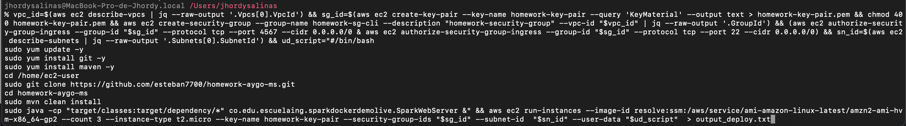
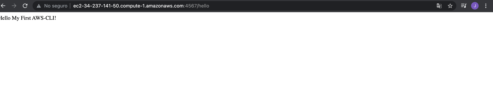
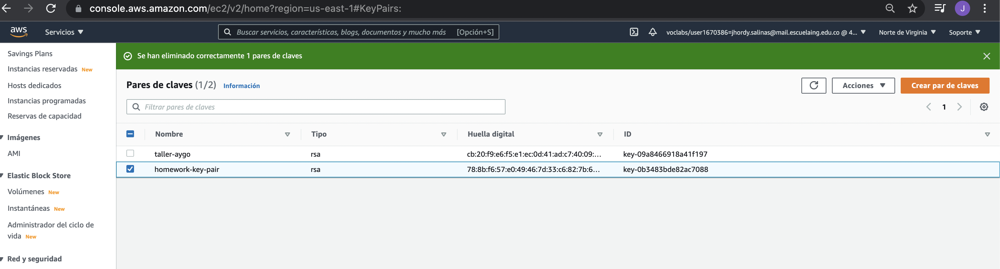
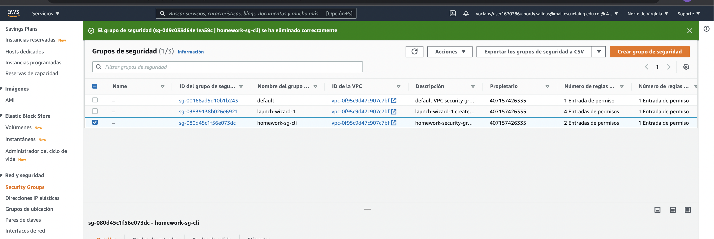
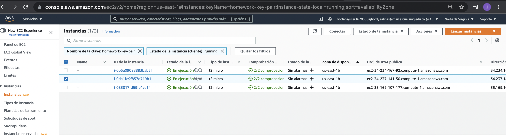

## WEB APP AUTOMATICALLY DEPLOYED TO AWS

### Comando

Luego de configurado aws-cli es suficiente con correr el siguiente comando que construi, en mi caso es en una zsh shell:

```
vpc_id=$(aws ec2 describe-vpcs | jq --raw-output '.Vpcs[0].VpcId') && sg_id=$(aws ec2 create-key-pair --key-name homework-key-pair --query 'KeyMaterial' --output text > homework-key-pair.pem && chmod 400 homework-key-pair.pem && aws ec2 create-security-group --group-name homework-sg-cli --description "homework-security-group" --vpc-id "$vpc_id" | jq --raw-output '.GroupId') && (aws ec2 authorize-security-group-ingress --group-id "$sg_id" --protocol tcp --port 4567 --cidr 0.0.0.0/0 & aws ec2 authorize-security-group-ingress --group-id "$sg_id" --protocol tcp --port 22 --cidr 0.0.0.0/0) && sn_id=$(aws ec2 describe-subnets | jq --raw-output '.Subnets[0].SubnetId') && ud_script="#/bin/bash
sudo yum update -y
sudo yum install git -y
sudo yum install maven -y
cd /home/ec2-user
sudo git clone https://github.com/esteban7700/homework-aygo-ms.git
cd homework-aygo-ms
sudo mvn clean install
sudo java -cp "target/classes:target/dependency/*" co.edu.escuelaing.sparkdockerdemolive.SparkWebServer &" && aws ec2 run-instances --image-id resolve:ssm:/aws/service/ami-amazon-linux-latest/amzn2-ami-hvm-x86_64-gp2 --count 3 --instance-type t2.micro --key-name homework-key-pair --security-group-ids "$sg_id" --subnet-id  "$sn_id" --user-data "$ud_script"  > output_deploy.txt
```

### Imagenes de las instancias UP luego de correr comando

Comando:



Web:



KeyPair:



SecurityGroup:



Instances:


